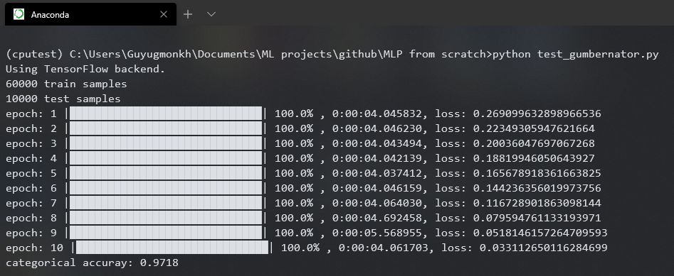

# MLP-from-scratch
Multi Layer Perceptron implementation from scratch in Python

This project improves on my other project ANN (Artificial Neural Network) from scratch using C++

It uses numerical Python modules to speed up the performance. These modules are Numpy and Scipy.
I did not use Tensorflow or any other deep learning libraries, since it will defeat the purpose of building it
from scratch.

Features:
* **Activations**: Sigmoid, Tanh, ReLU, LeakyReLU, Softmax
* **Losses**: MSE(Mean Squared Error), MAE(Mean Absolute Error), categorical_cross_entropy
* **Batch learning**, **Accuracy evaluation**
* **Selective data_type** ex: ('float16', 'float32', ...)
* **Optimizers**: SGD, Adagrad, *Adadelta, RMSprop

(*) - Currently broken

The real purpose of this project was to come up with a new optimizer or loss function. Unfortunately, that goal is
not fulfilled.

My implementation is highly inspired by Keras, it is not as fast but not terribly slow either considering it's only using Numpy.
In terms of accuracy, almost the same results across the board.

**Final results are shown below: (MNIST digits, batch_size = 64, epochs = 10)**

**My implementation's result:**

  

**Keras's result:**

  

